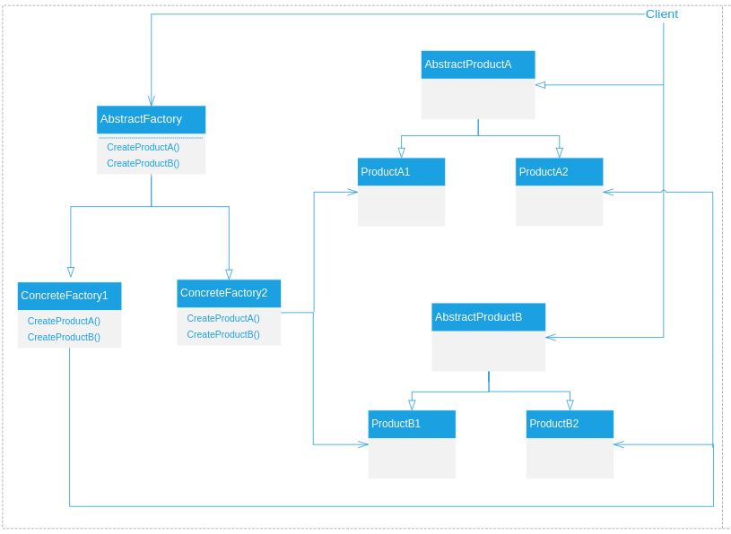

### Abstract Factory 抽象工厂模式


提供一个创建一系列相关或相互依赖对象的接口，而无需指定它们具体的类。

##### 适应性：

1. 一个系统要独立于它的产品的创建、组合和表示时；
2. 一个系统要由多个产品系统中的一个来配置时；
3. 当你要强调一系统相关的产品对象的设计以便进行联合使用时；
4. 当你提供一个产品类库，而只想显示它们的接口而不是实现时。

##### 效果：

1. 它分离了具体的类；
2. 它使得易于交换产品系统；
3. 它有利于产品的一致性；
4. 难以支持新种类的产品。

##### 结构：



##### Dubbo中的应用：

| 抽象类                  | 实现类                   | 说明              |
| ----------------------- | ------------------------ | ----------------- |
| AbstractRegistryFactory | DubboRegistryFactory     | DubboRegistry     |
|                         | ZookeeperRegistryFactory | ZookeeperRegistry |
|                         | RedisRegistryFactory     | RedisRegistry     |
|                         | ConsulRegistryFactory    | ConsulRegistry    |
|                         | EtcdRegistryFactory      | EtcdRegistry      |
|                         | MulticastRegistry        | MulticastRegistry |
|                         | MultipleRegistryFactory  | MultipleRegistry  |
| AbstractRegistry        | FailbackRegistry         |                   |

抽象类
```java
@SPI("dubbo")
public interface RegistryFactory {
    @Adaptive({"protocol"})
    Registry getRegistry(URL url);

}
public abstract class AbstractRegistryFactory implements RegistryFactory {
	//.....
    
    @Override
    public Registry getRegistry(URL url) {
		//...
        //create registry by spi/ioc
        registry = createRegistry(url);
        if (registry == null) {
            throw new IllegalStateException("Can not create registry " + url);
        }
        REGISTRIES.put(key, registry);
        return registry;

    }

    protected abstract Registry createRegistry(URL url);

}
```

实现类

1. DubboRegistryFactory

```java
public class DubboRegistryFactory extends AbstractRegistryFactory {

    @Override
    public Registry createRegistry(URL url) {
        //...
        DubboRegistry registry = new DubboRegistry(registryInvoker, registryService);
        //...
        return registry;
    }
}

```

2. ZookeeperRegistryFactory
```java
public class ZookeeperRegistryFactory extends AbstractRegistryFactory {

	//...

    @Override
    public Registry createRegistry(URL url) {
        return new ZookeeperRegistry(url, zookeeperTransporter);
    }

}
```

3. RedisRegistryFactory

```java
public class RedisRegistryFactory extends AbstractRegistryFactory {

    @Override
    protected Registry createRegistry(URL url) {
        return new RedisRegistry(url);
    }

}
```

